# Android JNI编程笔记

> 实际项目中的算法库很多事C++代码编写的，算法工程师经常面对的一个问题就是算法的跨平台调用，比如算法工程师在平常工作中事基于C++代码进行算法开发的，而公司开发一款Android系统的应用程序，需要调用C++算法库，如何调用成为了一个很重要的的问题。解决这类问题的**核心思想**是：
>
> 1. 利用跨平台编译工具CMake，即只需要一次编写算法代码，就可在多个平台生成对应的算法库；
> 2. Android开发时基于Java语言而算法库是基于C++语言实现的，因此在Android开发中用Java调用C++算法接口时需要使用JNI(Java Native Interface)来搭建Java与C++之间的沟通桥梁。

- [Android JNI编程笔记](#android-jni编程笔记)
- [0 Requirements](#0-requirements)
- [1 Configuration Environment](#1-configuration-environment)
- [2. 构建JNI工程，进行原生库C++程序开发。](#2-构建jni工程进行原生库c程序开发)
- [3 代码分析](#3-代码分析)
- [4 向现有工程中添加自定义类](#4-向现有工程中添加自定义类)
- [5 在新项目中调用生成的库文件](#5-在新项目中调用生成的库文件)
- [6 向现有工程中添加第三方库](#6-向现有工程中添加第三方库)
- [7 将C++中的输出打印到日志中](#7-将c中的输出打印到日志中)
- [8 读取assets文件夹下文件](#8-读取assets文件夹下文件)
- [Reference](#reference)

# 0 Requirements

- Android Studio 2021.1.1：Android集成开发环境
- NDK：这套工具集允许您为 Android 使用 C 和 C++ 代码，并提供众多平台库，让您可以管理原生 Activity 和访问物理设备组件，例如传感器和触摸输入。
- CMake：一款外部构建工具，可与 Gradle 搭配使用来构建原生库。
- LLDB：默认安装。

# 1 Configuration Environment

1. 打开Android Studio，选择File->Settings->Appearance&Behavior->System Settings->Android SDK->SDK Tools。勾选**CMake、NDK、Android SDK Platform-Tools**，如下图所示。

    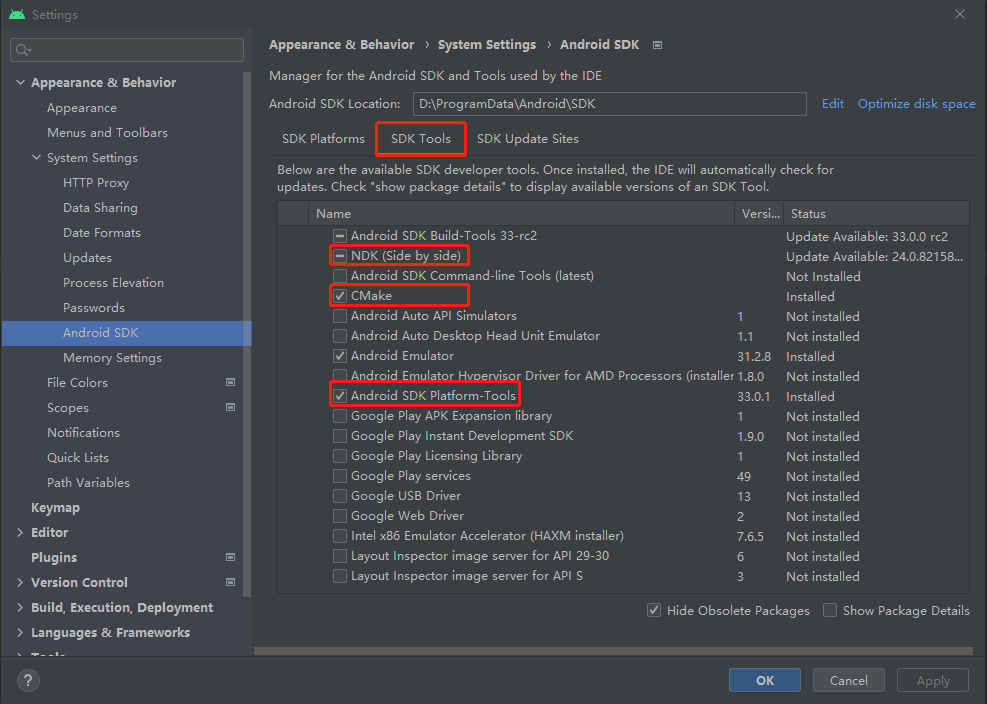

2. 点击Apply，等待安装完成关闭窗口即可。

# 2. 构建JNI工程，进行原生库C++程序开发。

1. File->New Project，选择Native C++，表示项目中启用C++支持，然后点击Next进入下一步。

    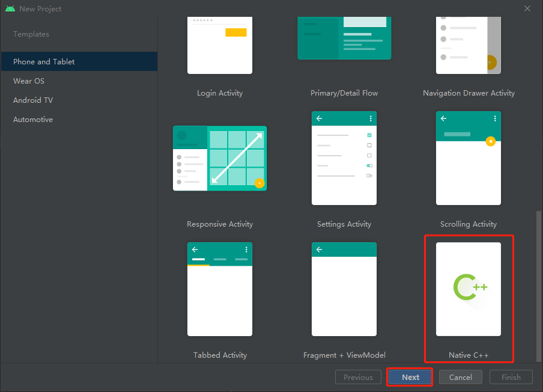

2. 设置工程名称(Name)、包名(Package name)、项目保存位置(Save location)、编程语言(Language)默认选择Java以及Android SDK的最小版本。设置完成后选择Next进入下一步。如图所示。

    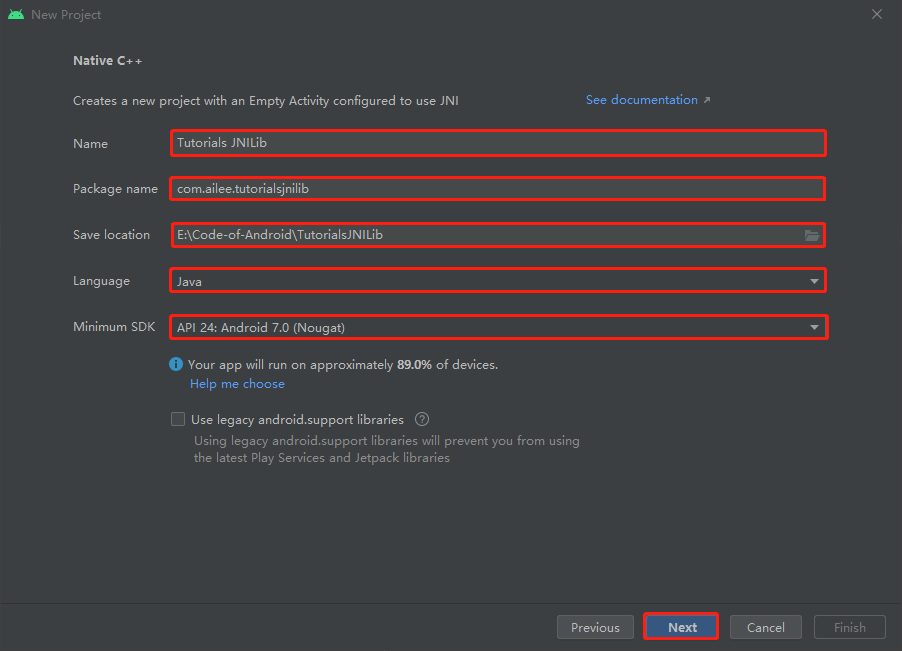

3. 选择支持的C++标准，此处选择C++11，可根据需要选择。点击Finish结束。如图所示。

    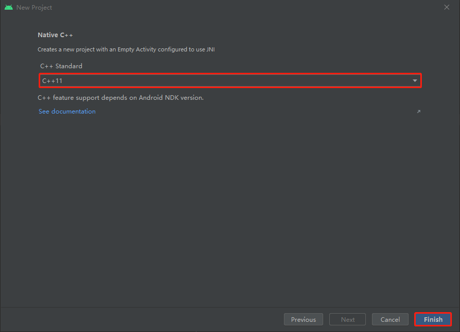

4. 切换到Project视图，构建好的工程如下图所示。

    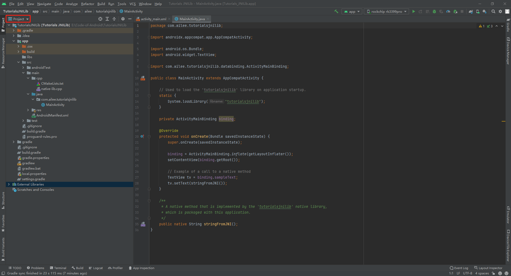

5. 修改app->src->main->cpp-CMakeLists.txt，将project参数改为**tutorialsjni**，将add_library()和target_link_libraries()下的**tutorialsjnilib**改为**${PROJECT_NAME}**，使得生成得动态链接库名称为**libtutorialsjni.so**。

    ```cmake
    # For more information about using CMake with Android Studio, read the
    # documentation: https://d.android.com/studio/projects/add-native-code.html
    
    # Sets the minimum version of CMake required to build the native library.
    
    cmake_minimum_required(VERSION 3.18.1)
    
    # Declares and names the project.
    
    project("tutorialsjni")
    
    # Creates and names a library, sets it as either STATIC
    # or SHARED, and provides the relative paths to its source code.
    # You can define multiple libraries, and CMake builds them for you.
    # Gradle automatically packages shared libraries with your APK.
    
    add_library( # Sets the name of the library.
            ${PROJECT_NAME}
    
            # Sets the library as a shared library.
            SHARED
    
            # Provides a relative path to your source file(s).
            native-lib.cpp)
    
    # Searches for a specified prebuilt library and stores the path as a
    # variable. Because CMake includes system libraries in the search path by
    # default, you only need to specify the name of the public NDK library
    # you want to add. CMake verifies that the library exists before
    # completing its build.
    
    find_library( # Sets the name of the path variable.
            log-lib
    
            # Specifies the name of the NDK library that
            # you want CMake to locate.
            log)
    
    # Specifies libraries CMake should link to your target library. You
    # can link multiple libraries, such as libraries you define in this
    # build script, prebuilt third-party libraries, or system libraries.
    
    target_link_libraries( # Specifies the target library.
            ${PROJECT_NAME}
    
            # Links the target library to the log library
            # included in the NDK.
            ${log-lib})
    ```

6. 在app->build.gradle文件中找到**cppFlags**，在下方添加如下内容可以生成指定硬件架构的库文件，不添加默认生成所有支持的硬件架构类型的库文件。

    ```
    //生成多个版本的so文件
    abiFilters 'arm64-v8a','armeabi-v7a'
    ```

7. 修改app->src->main->java->MainActivity中加载库文件名称为**tutorialsjni**。

    ```java
    System.loadLibrary("tutorialsjni");
    ```

8. 点击build->Make Project，编译工程，在build窗口可查看编译输出信息，编译完成可在app->build->intermediates->cmake->debug->obj看到不同架构下的库文件，文件名为**libtutorialsjni.so**。如下图所示。

    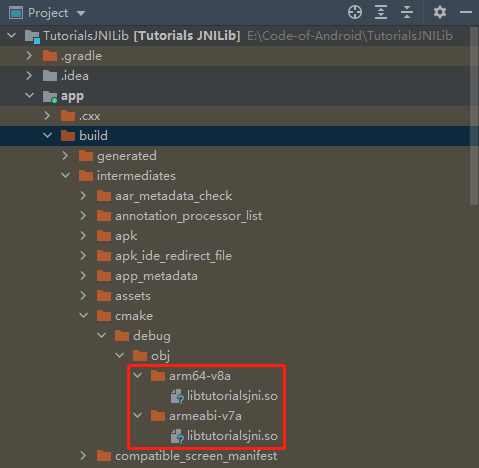

9. 将在Build Variants中将Active Build Variant切换为release，重新编译工程即可生成release版本的动态链接库。

    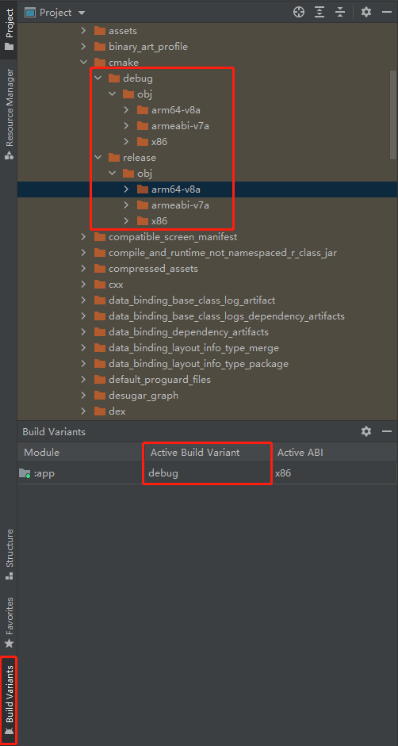

10. 选择Tools->Device Manager，在Virtual页面点击Create device创建模拟器（此处不详细描述），或在Physical页面下添加物理Android设备，以便于后续调试程序。下图为rk3399开发板。

    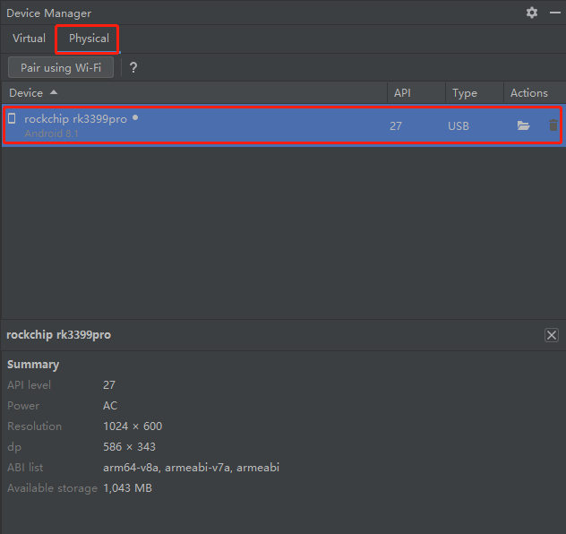

11. 检查设备连接，运行程序。

    

12. 程序运行成功，可在屏幕上看到如下内容。

    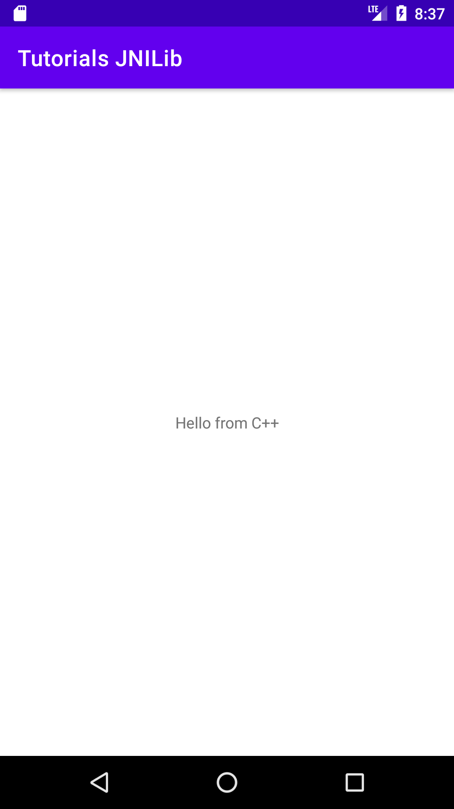

# 3 代码分析

1. 在app->src->main->java->MainActivity.java中定义了一个本地方法stringFromJNI()。

    ```java
    /**
     * A native method that is implemented by the 'tutorialsjnilib' native library,
     * which is packaged with this application.
     */
    public native String stringFromJNI();
    ```

2. 在在app->src->main->cpp->native-lib.cpp实现了上述方法，native-lib.cpp为一种固定格式，提供JNI接口函数实现。

    ```c++
    #include <jni.h>
    #include <string>
    
    extern "C" JNIEXPORT jstring JNICALL
    Java_com_ailee_tutorialsjnilib_MainActivity_stringFromJNI(
            JNIEnv* env,
            jobject /* this */) {
        std::string hello = "Hello from C++";
        return env->NewStringUTF(hello.c_str());
    }

3. jni.h中定义了java与C/C++之间的一些相互转换关系。

4. 在app->src->main->java->MainActivity.java中，利用一下代码调用生成的动态链接库。

    ```java
    System.loadLibrary("tutorialsjni");
    ```

5. 以上即实现了一个Hello World级别的JNI接口实例。

# 4 向现有工程中添加自定义类

> 一般情况下我们都是用JNI直接调用C/C++的某个方法代码，包括Android Studio生成的示例代码也是直接调用JNI接口函数。但有时我们需要新建或者得到的是C++自定义类，在调用时就不能像掉用C++方法一样。此处以Person类举例。

**完整工程代码[Tutorials JNILib](https://github.com/gitleej/tutorials-jnilib)**

1. 创建Java类，作为一个接口。在app->src->main->java->com.ailee.tutorialsjnilib包下添加PersonInterface类。

    ```java
    package com.ailee.tutorialsjnilib;
    
    /**
     * @brief Person 接口类，具体方法在JNI中实现，用于解释怎样通过JNI调用自定义C++类
     * E-mail   lijie@fjirsm.ac.cn
     * Created by AILEE on 2022/3/23 17:01
     */
    public class PersonInterface {
        // 用于保存C++类指针，建议使用long以兼容64位系统
        long nativePersonInterface;
    
        /**
         * @brief   构造函数
         */
        public PersonInterface() {
            nativePersonInterface = createNativeObjectJNI();
        }
    
        /**
         * @brief   设置姓名
         * @param   name    姓名
         */
        public void setName(String name) {
            setNameJNI(nativePersonInterface, name);
        }
    
        /**
         * @brief   设置年龄
         * @param   age 年龄
         */
        public void setAge(int age) {
            setAgeJNI(nativePersonInterface, age);
        }
    
        /**
         * @brief   获取姓名
         * @return  String  姓名
         */
        public String getName() {
            return getNameJNI(nativePersonInterface);
        }
    
        /**
         * @brief   获取年龄
         * @return  int 年龄
         */
        public int getAge() {
            return getAgeJNI(nativePersonInterface);
        }
    
        // 本地方法
        /**
         * @brief   创建一个C++对象
         * @return  long C++对象指针地址
         */
        private native long createNativeObjectJNI();
    
        /**
         * @brief   设置姓名
         * @param   addr    C++类指针
         * @param   name    姓名
         */
        private native void setNameJNI(long addr, String name);
    
        /**
         * @brief   设置年龄
         * @param   addr    c++类指针地址
         * @param   age     年龄
         */
        private native void setAgeJNI(long addr, int age);
    
        /**
         * @brief   获取姓名
         * @param   addr    C++类指针地址
         * @return  String  姓名
         */
        private native String getNameJNI(long addr);
    
        /**
         * @brief   获取年龄
         * @param   addr    C++类指针地址
         * @return  int     年龄
         */
        private native int getAgeJNI(long addr);
    }
    ```

2. 创建C++类，实现Person接口。在app->src->main->cpp下，右键New->C++ Class 添加Person类。

    - 在Person.h中添加如下内容

        ```c++
        //
        // Created by AILEE on 2022/3/23.
        //
        
        #ifndef TUTORIALS_JNILIB_PERSON_H
        #define TUTORIALS_JNILIB_PERSON_H
        
        #include <string>
        
        /**
         * @class   Person
         * E-mail   lijie@fjirsm.ac.cn
         * Created by AILEE on 2022/3/23 17:32
         */
        class Person {
        public:
            /**
             * @brief       构造函数
             * @author      AILEE
             * @date        2022/3/23
             */
            Person();
        
            /**
             * @brief       设置姓名
             * @param[in]   name    姓名
             * @return      void
             * @author      AILEE
             * @date        2022/3/23
             */
            void setName(std::string name);
        
            /**
             * @brief       设置年龄
             * @param[in]   age     年龄
             * @return      void
             * @author      AILEE
             * @date        2022/3/23
             */
            void setAge(int age);
        
            /**
             * @brief       获取姓名
             * @return      string  姓名
             * @author      AILEE
             * @date        2022/3/23
             */
            std::string getName();
        
            /**
             * @brief       获取年龄
             * @return      int     年龄
             * @author      AILEE
             * @date        2022/3/23
             */
            int getAge();
        
        private:
            std::string m_name;     ///< 姓名
            int         m_age;      ///< 年龄
        };
        
        #endif //TUTORIALS_JNILIB_PERSON_H
        
        ```

    - 在Person.cpp中添加如下内容

        ```c++
        //
        // Created by AILEE on 2022/3/23.
        //
        
        #include "Person.h"
        
        Person::Person() :
            m_age(0),
            m_name("No Name"){
        
        }
        
        void Person::setName(std::string name) {
            this->m_name = name;
        }
        
        void Person::setAge(int age) {
            this->m_age = age;
        }
        
        std::string Person::getName() {
            return this->m_name;
        }
        
        int Person::getAge() {
            return this->m_age;
        }
        ```

3. 在Java类中定义的native本地方法都会标红，选中标红的方法，快捷键Alt+Enter可在native-lib.cpp中生成对应的JNI接口函数，按照如下内容修改相关函数的实现。

    ```c++
    #include "Person.h"
    
    #include <jni.h>
    #include <string>
    
    // 将jstring转char
    char * _Jstring2CStr( JNIEnv * env, jstring jstr )
    {
        char * rtn = NULL;
        jclass clsstring = env->FindClass("java/lang/String");
        jstring strencode = env->NewStringUTF("GB2312");
        jmethodID mid = env->GetMethodID(clsstring, "getBytes", "(Ljava/lang/String;)[B");
        jbyteArray barr= (jbyteArray)env->CallObjectMethod(jstr,mid,strencode);
        jsize alen = env->GetArrayLength(barr);
        jbyte * ba = env->GetByteArrayElements(barr,JNI_FALSE);
        if(alen > 0)
        {
            rtn = (char*)malloc(alen+1); //new char[alen+1];
            memcpy(rtn,ba,alen);
            rtn[alen]=0;
        }
        env->ReleaseByteArrayElements(barr,ba,0);
    
        return rtn;
    }
    
    extern "C" JNIEXPORT jstring JNICALL
    Java_com_ailee_tutorialsjnilib_MainActivity_stringFromJNI(
            JNIEnv* env,
            jobject /* this */) {
        std::string hello = "Hello from C++";
        return env->NewStringUTF(hello.c_str());
    }
    
    extern "C"
    JNIEXPORT jlong JNICALL
    Java_com_ailee_tutorialsjnilib_PersonInterface_createNativeObjectJNI(JNIEnv *env, jobject thiz) {
        jlong result;
        result = (jlong) new Person();
        return result;
    }
    
    extern "C"
    JNIEXPORT void JNICALL
    Java_com_ailee_tutorialsjnilib_PersonInterface_setNameJNI(JNIEnv *env, jobject thiz, jlong addr,
                                                              jstring name) {
        // jString 转 cString
        char * cName = _Jstring2CStr(env, name);
        // 对象指针调用方法
        ((Person*)addr)->setName(std::string(cName));
    }
    
    extern "C"
    JNIEXPORT void JNICALL
    Java_com_ailee_tutorialsjnilib_PersonInterface_setAgeJNI(JNIEnv *env, jobject thiz, jlong addr,
                                                             jint age) {
        ((Person*)addr)->setAge(age);
    }
    
    extern "C"
    JNIEXPORT jstring JNICALL
    Java_com_ailee_tutorialsjnilib_PersonInterface_getNameJNI(JNIEnv *env, jobject thiz, jlong addr) {
        std::string cName = ((Person*)addr)->getName();
        return env->NewStringUTF(cName.c_str());
    }
    
    extern "C"
    JNIEXPORT jint JNICALL
    Java_com_ailee_tutorialsjnilib_PersonInterface_getAgeJNI(JNIEnv *env, jobject thiz, jlong addr) {
        return ((Person*)addr)->getAge();
    }
    ```

4. 至此，已经完成了程序的构建，现修改CMakeList.txt，将Person.cpp添加到add_library中

    ```
    add_library( # Sets the name of the library.
            ${PROJECT_NAME}
    
            # Sets the library as a shared library.
            SHARED
    
            # Provides a relative path to your source file(s).
            Person.cpp
            Person.h
            native-lib.cpp)
    ```

5. 在MainActivity中，创建Java对象PersonInterface，并调用它的方法，通过它的方法来调用C++类的方法。

    ```java
    @Override
    protected void onCreate(Bundle savedInstanceState) {
        super.onCreate(savedInstanceState);
    
        binding = ActivityMainBinding.inflate(getLayoutInflater());
        setContentView(binding.getRoot());
    
        // test PersonInterface
        PersonInterface personInterface = new PersonInterface();
        personInterface.setName("Zhang San");
        personInterface.setAge(18);
        String name = personInterface.getName();
        int age = personInterface.getAge();
        // 输出姓名和年龄
        Log.e("MainActivity", "Name: " + name + "\tAge: " + age);
    
        // Example of a call to a native method
        TextView tv = binding.sampleText;
        tv.setText(stringFromJNI());
    }
    ```

6. 点击运行程序，即可在Logcat中查看到程序的输出。

    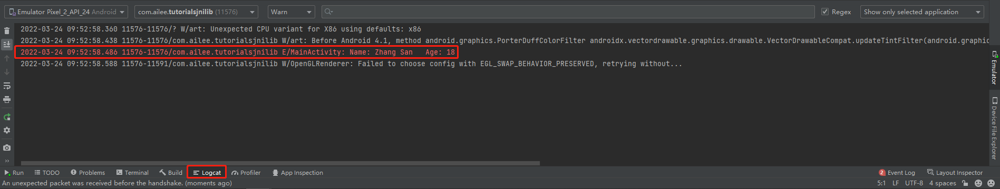

# 5 在新项目中调用生成的库文件

**完整工程代码[Tutorials JNILib Test](https://github.com/gitleej/tutorials-jnilib-demo)**

1. File->New->New Project，创建新的工程，选择Empty Activity。

    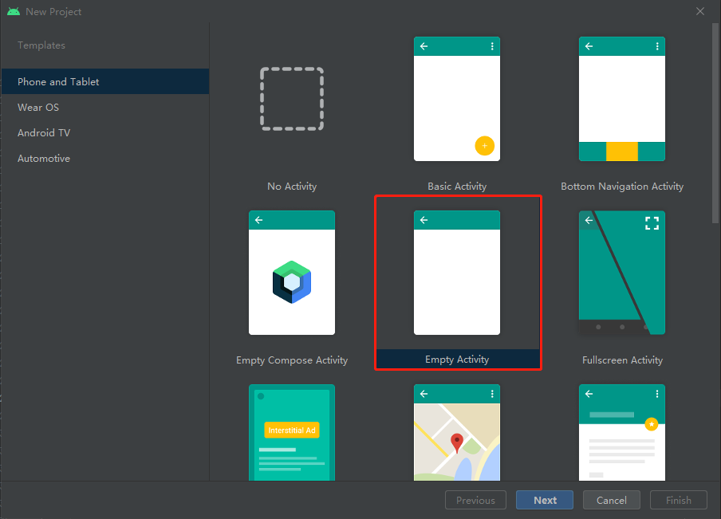

2. 点击Next进入下一步，设置好工程相关信息。

    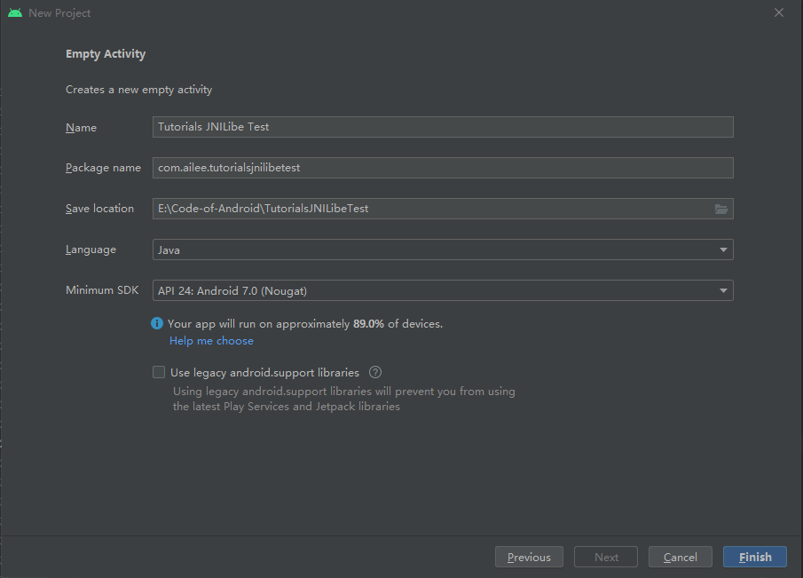

3. 点击Finish，完成工程构建。将工程结构切换到Project，并将第5节中生成的动态链接库复制到app->libs下。

    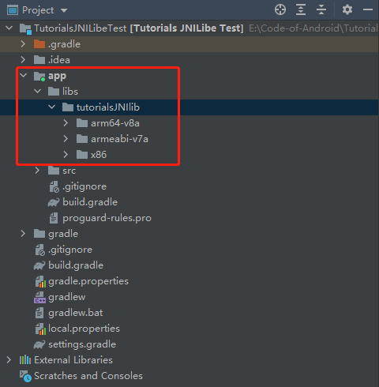

4. 在app->src->main->java下添加和JNI库工程相同的包com.ailee.tutorialsjnilib，并在包下添加第5节中的Java类。

    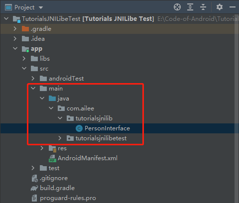

5. 在app->build.gradle中添加如下内容，使工程能自动查找合适的sdk。

    ```gradle
    sourceSets {
        main {
            jniLibs.srcDirs = ['libs/tutorialsJNIlib']
        }
    }
    ```

6. 在MainActivity中添加如下代码用于加载动态库。

    ```java
    // Used to load the 'yishi' library on application startup.
    static {
        System.loadLibrary("tutorialsjni");
    }
    ```

7. 在MainActivity中添加测试代码，测试库的调用。

    ```java
    package com.ailee.tutorialsjnilibetest;
    
    import androidx.appcompat.app.AppCompatActivity;
    
    import android.os.Bundle;
    import android.util.Log;
    
    import com.ailee.tutorialsjnilib.PersonInterface;
    
    public class MainActivity extends AppCompatActivity {
        // Used to load the 'yishi' library on application startup.
        static {
            System.loadLibrary("tutorialsjni");
        }
    
        @Override
        protected void onCreate(Bundle savedInstanceState) {
            super.onCreate(savedInstanceState);
            setContentView(R.layout.activity_main);
    
            // test PersonInterface
            PersonInterface personInterface = new PersonInterface();
            personInterface.setName("Zhang San");
            personInterface.setAge(18);
            String name = personInterface.getName();
            int age = personInterface.getAge();
            // 输出姓名和年龄
            Log.e("MainActivity", "Name: " + name + "\tAge: " + age);
        }
    }
    ```

8. 运行程序，程序正常运行将显示如下内容。

    1. Logcat中看到正确输出了测试案例的内容。

        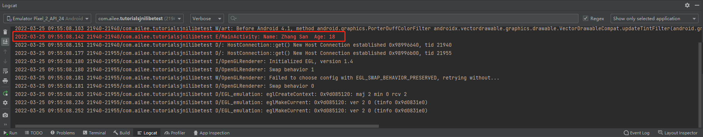

    2. 并在Android设备中显示如下内容。

        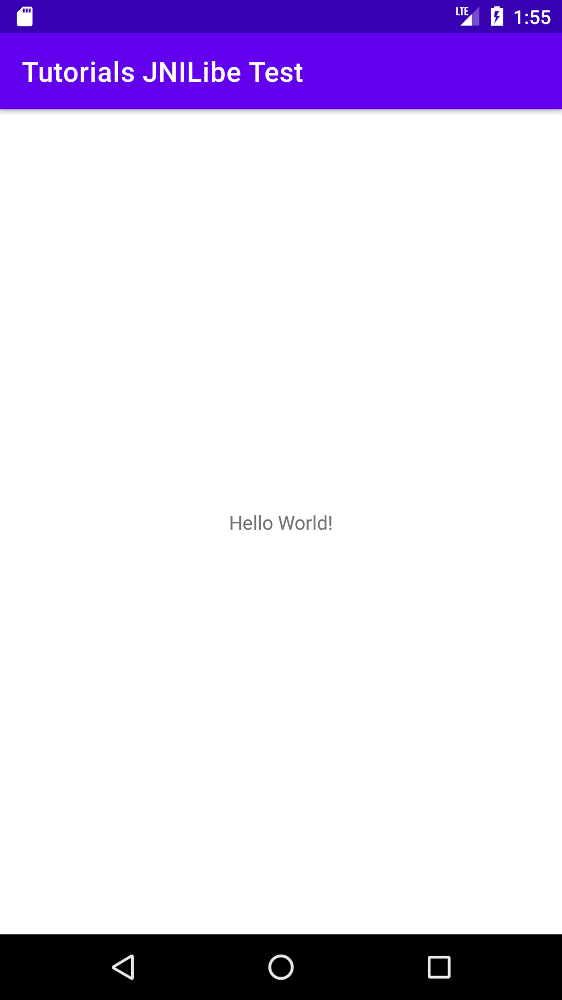

# 6 向现有工程中添加第三方库

在进行算法开发的过程中难免存在调用第三方库的情况，此处以[OpenCV-mobile](https://github.com/nihui/opencv-mobile)为例：

1. 下载OpenCV-mobile库并解压，将解压的文件夹复制到app->libs下

2. 修改app->src->main->cpp->CMakeList.txt

    ```cmake
    # set OpenCV
    set(OpenCV_DIR ${CMAKE_SOURCE_DIR}/../../../libs/opencv-mobile-3.4.16-android/sdk/native/jni)
    find_package(OpenCV REQUIRED)
    
    target_link_libraries( # Specifies the target library.
            ${PROJECT_NAME}
    
            ${OpenCV_LIBS}
            # Links the target library to the log library
            # included in the NDK.
            ${log-lib})
    ```

3. 接下来即可在你所编写的C++原生库中调用第三方库了。

4. 参考[opencv-mobile：https://github.com/nihui/opencv-mobile](https://github.com/nihui/opencv-mobile)

# 7 将C++中的输出打印到日志中

1. 在C++程序中定义如下宏函数

    ```c++
    #include <android/log.h>
    #define LOGD(tag, ...) __android_log_print(ANDROID_LOG_DEBUG, tag, __VA_ARGS__)
    #define LOGI(tag, ...) __android_log_print(ANDROID_LOG_INFO, tag, __VA_ARGS__)
    #define LOGE(tag, ...) __android_log_print(ANDROID_LOG_ERROR, tag, __VA_ARGS__)
    ```

2. 在CMakeList.txt中包含log库

    ```cmake
    find_library( # Sets the name of the path variable.
            log-lib
            
            log)
    target_link_libraries( # Specifies the target library.
            ${PROJECT_NAME}
            
            ${log-lib})
    ```

3. 在C++程序中直接按照如下方式进行调用即可

    ```c++
    LOGI("TAG", "Info Msg.");
    LOGD("TAG", "Debug Msg.");
    LOGE("TAG", "Error Msg.");
    ```

# 8 读取assets文件夹下文件

> 参考：[Android: 在native中访问assets全解析 https://www.cnblogs.com/willhua/p/9692529.html](https://www.cnblogs.com/willhua/p/9692529.html)

```c++
// 通过JNI获取Java传入的AAssetManager
AAssetManager *mgr = AAssetManager_fromJava(env, assetManager);
/**
 * @brief       读取assets文件夹下的label.txt
 * @param[in]   assetManager    获取assets文件路径
 * @param[in]   assetPath   标签文件
 * @return      int 错误代码 0-成功
 * @author      AILEE
 * @date        2022/3/17
 */
int Dataloader::loadLabels(AAssetManager *assetManager, const char *assetPath) {
    // open file.
    AAsset *assetFile = AAssetManager_open(assetManager, assetPath, AASSET_MODE_BUFFER);
    // get file length.
    size_t fileLength = AAsset_getLength(assetFile);
    char *dataBuffer = (char *) malloc(fileLength);
    // read file data
    AAsset_read(assetFile, dataBuffer, fileLength);
    // close file
    AAsset_close(assetFile);

    // decode the file to vector
    std::string labels(dataBuffer);
    this->strSplit(labels, this->m_labels, "\r\n");

    free(dataBuffer);
    return 0;
}
```

# Reference

- [尚硅谷Android时评教程《JNI》 https://www.bilibili.com/video/BV1qW411L7oY?p=25](https://www.bilibili.com/video/BV1qW411L7oY?p=25)
- [Android: 在native中访问assets全解析 https://www.cnblogs.com/willhua/p/9692529.html](https://www.cnblogs.com/willhua/p/9692529.html)
- [Android修炼系列（十九），来编译一个自己的 so 库吧 https://juejin.cn/post/6973956102115295239](https://juejin.cn/post/6973956102115295239)
- [android studio ndk-build 编译C生成.so文件（ndk基础篇）https://blog.csdn.net/cheng2290/article/details/77717164](https://blog.csdn.net/cheng2290/article/details/77717164)
- [android studio cMake脚本添加ndk，构建C/C++程序(基础使用篇) https://blog.csdn.net/cheng2290/article/details/77867197](https://blog.csdn.net/cheng2290/article/details/77867197)
- [Android开发调用C++算法库完全指南（亲测可用）https://blog.csdn.net/algorithmPro/article/details/97342638](https://blog.csdn.net/algorithmPro/article/details/97342638)
- [在 Android Studio 中使用 C/C++ 链接库：以 OpenCV 3.4.1 为例 https://cwang.me/2020/02/13/android-studio-cpp-library/](https://cwang.me/2020/02/13/android-studio-cpp-library/)
- [Android：JNI调用C++自定义类的详细方法 https://blog.csdn.net/chaoqiangscu/article/details/83023762](https://blog.csdn.net/chaoqiangscu/article/details/83023762)